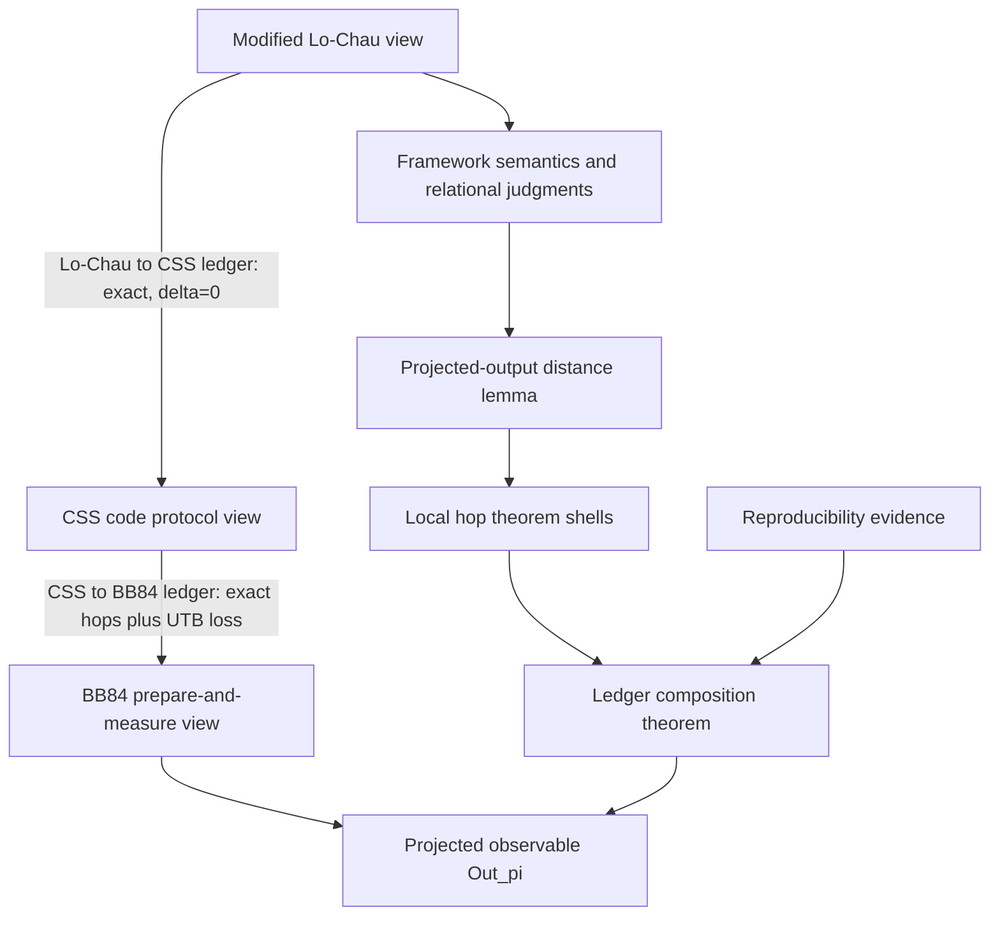

# Conservative Patch Report

Protect scope: do NOT change title/abstract/introduction. Insert one new bridging section between introduction and verification framework. Elsewhere, only perform improvements/modifications, not wholesale rewrites. Flag any discovered mathematical errors; do not silently change results. Define acceptance criteria: every symbol defined before use; every local hop labeled exact or lossy with explicit δ; theorem shells before ledgers; notation collisions resolved; reproducibility section with artifact coverage matrix.

## 1. Executive Summary

The patched manuscript keeps the title, abstract, and introduction unchanged, then inserts exactly one compact bridge section before the verification framework. The bridge makes the paper read as a QKD reduction paper before it introduces the verifier: it states the protocol-view chain, fixes the projected observable, defines the exact-vs-lossy ledger discipline, and gives the roadmap from case study to framework, ledgers, and reproducibility.

The remaining changes are line-level or paragraph-level patches. They add theorem shells for both ledgers, a composition theorem, and a projected-output lemma that connects approximate relational judgments to total-variation bounds on the final observable. The notation collision between approximation budgets and BB84 length slack is repaired by reserving `\delta` and `\delta_{\mathrm{UTB}}` for proof loss, while using `s` for the block-length slack in `4n+s` and `2n+s`. No mathematical error requiring an `[ERROR FLAG]` correction was found during this pass.

The evaluation section is reframed as reproducibility evidence. It now distinguishes proof-engineering metrics from protocol parameters, marks the displayed large `\delta_{\mathrm{UTB}}` as demonstration-only, gives the exact binomial bad-event expression for the matched-basis step, and includes an artifact coverage matrix. The appendices remain intact but now expose compact status tables for syntax macros and proof rules.

## 2. Section-by-Section Issue List

| Location cue | Issue | Patch type | Resolution |
|---|---|---|---|
| `main.tex:109`, before `\section{Verification Framework}` | The introduction moved directly into framework details without first fixing the QKD reduction ledger. | [insert] | Inserted `QKD Reduction Ledger at a Glance` as the single bridge section. |
| `main.tex:143`, opening of `Verification Framework` | Target, adversary abstraction, public transcript model, and observable needed to be restated before syntax. | [insert] | Added a compact opening paragraph tying the framework to the fixed observable. |
| `main.tex:160-218`, syntax paragraphs | Primitive syntax and derived syntax could be read as one level. | [replace sentence] | Clarified the primitive/derived split and kept full expansions in the appendix. |
| `main.tex:220-235`, quantum renaming paragraph | Quantum aliasing could be mistaken for executable copy/assignment. | [insert] | Added a no-copy remark that treats quantum append/renaming as meta-level address binding. |
| `main.tex:250-273`, judgment definition | The manuscript used approximate judgments before giving an explicit projected-output consequence. | [add lemma] | Added Lemma `Projected-output distance` with a proof sketch. |
| `main.tex:426-459`, start of hopping section | Ledgers lacked a common theorem shell for local hop obligations. | [add theorem shell] | Added `Local hop shell`, naming the observable and distance notion. |
| `main.tex:491-503`, Lo-Chau to CSS ledger | The figure and prose claimed exactness but no theorem shell stated the result. | [add theorem shell] | Added `Lo--Chau to CSS ledger` with all local losses zero. |
| `main.tex:530-542`, Lo-Chau obligations | Exact/lossy status was distributed in prose and figure colors. | [insert] | Added a compact obligations table, all exact with `\delta=0`. |
| `main.tex:755-769`, CSS to BB84 ledger | The lossy matched-basis step needed an explicit theorem shell. | [add theorem shell] | Added `CSS to BB84 ledger` with only `\mathcal I_5` lossy. |
| `main.tex:799-812`, CSS to BB84 obligations | Local hop statuses needed to be auditable independent of color. | [insert] | Added a compact obligations table with `\delta_{\mathrm{UTB}}` on `\mathcal I_5`. |
| `main.tex:879-888`, after ledgers | The end-to-end ledger composition needed to be a theorem, not only prose. | [add theorem shell] | Added `Ledger composition` theorem with total loss `\delta_{\mathrm{UTB}}`. |
| `main.tex:783`, CSS to BB84 vocabulary | `\delta` was used as a length slack and as an approximation budget. | [rename notation] | Renamed the length slack to `s`; retained `\delta` only for proof loss. |
| `main.tex:1131-1163`, evaluation | Evaluation read like a metric summary rather than reproducibility evidence. | [reproducibility patch] | Renamed section and added bad-event calculation, parameter-sweep recommendation, and coverage matrix. |
| `main.tex:1168-1180`, discussion | Verified claims, assumptions, limitations, and next scope were blended together. | [split paragraph] | Added labeled paragraph leads without rewriting the conclusion globally. |
| `main.tex:1199-1230`, syntax appendix | Long syntax-sugar definitions lacked a compact status map. | [insert] | Added full-width macro status table. |
| `main.tex:1576-1625`, proof-rule appendix | Rule status was implicit. | [insert] | Added full-width rule status table marking core/derived/mechanized/script-guided status. |
| `main.tex:2140-2290`, references | Some comparator entries were duplicated or superseded by cleaner keys. | [reference fix] | Removed unused duplicates and added missing recent comparator entries cited in discussion. |

## 3. Notation Inventory

| Symbol | Meaning | Sort | First use | Action needed |
|---|---|---|---|---|
| `G`, `G'`, `G_j` | Protocol game/program checkpoint | program | `main.tex:117` | Defined by bridge ledger; no further action. |
| `\mathsf{MLC}`, `\mathsf{CSS}`, `\mathsf{BB84}` | Protocol-view games in the reduction chain | game family | `main.tex:116` | Defined before framework; no further action. |
| `\mathsf{Out}_{\pi}(G)` | Fixed projected observable of a game | classical distribution | `main.tex:119` | Standardized across theorem shells. |
| `\pi` | Public-transcript projection | projection | `main.tex:119` | Kept distinct from lifting witness `\pi`; consider renaming witness in future revision. |
| `\mathsf{Pub}(G)` | Public transcript of game `G` | classical transcript | `main.tex:119` | Defined in bridge and framework. |
| `K_A`, `K_B` | Alice and Bob final keys | classical registers | `main.tex:119` | Defined through observable. |
| `\delta`, `\delta_j` | Approximation budget for a judgment or hop | probability | `main.tex:124` | Reserved for proof loss. |
| `\delta_{\mathrm{UTB}}` | Loss from the upper-tail/bad-event bridge | probability | `main.tex:374` | Explicit exact formula added in reproducibility section. |
| `s` | BB84 block-length slack in `4n+s` | integer parameter | `main.tex:479` | Replaces former slack use of `\delta`. |
| `n`, `m` | Protocol size parameters | integer parameters | `main.tex:182` | Already defined near syntax/figures; keep local context. |
| `\Delta`, `\Delta'` | Input/output density operators | quantum states | `main.tex:240` | Defined in lifting section. |
| `A`, `\Phi`, `\Psi` | Relational assertions/projectors | assertion/projector | `main.tex:240` | Defined in judgment section. |
| `\llbracket P\rrbracket` | Denotational semantics of program `P` | superoperator | `main.tex:237` | Clarified before judgments. |
| `\vdash P\sim_{\delta}P'` | Approximate relational judgment | judgment | `main.tex:250` | Bridged to total variation by new lemma. |
| `\Delta_{\mathrm{TV}}` | Total variation distance | distance | `main.tex:270` | Named in theorem statements. |
| `\bar q`, `\bar q'` | Indexed quantum registers | quantum addresses | `main.tex:176` | No-copy remark added. |
| `\operatorname{addr}` | Address map from variable names to memory addresses | meta-level map | `main.tex:204` | Important definition retained in main text. |
| `B_0`, `B_1` | Proof-relevant protocol blocks in figures | program fragments | `main.tex:548` | Main text explains each block when first used in ledgers. |
| `\mathcal I_i` | Local interface/hop label | ledger edge | `main.tex:503` | Every listed interface now has exact/lossy status. |
| `\mathsf{Bad}_{\mathrm{sift}}` | Matched-basis failure event | event | `main.tex:855` | Explicit probability expression added. |

## 4. Detailed Edit Checklist

| Original cue | Revised snippet | Patch annotation | Reason |
|---|---|---|---|
| "Verification Framework" followed introduction | "QKD Reduction Ledger at a Glance" | [insert] | Foregrounds the QKD reduction before verifier machinery. |
| "Programs are hybrid..." | "We separate primitive commands from derived notation" | [replace sentence] | Avoids mixing grammar and macros. |
| "Quantum variables ... addresses" | "Quantum aliases are not executable assignments" | [insert] | Prevents no-cloning confusion. |
| Approximate judgment only | "Projected-output distance" | [add lemma] | Connects logic to final cryptographic distance. |
| "Hopping of Games" ledgers | "Local hop shell" | [add theorem shell] | Gives a common theorem shape before figures. |
| Lo-Chau prose exactness | "All five displayed local interfaces are exact" | [add theorem shell] | Makes exact ledger claim explicit. |
| CSS-BB84 prose loss | "Edge `\mathcal I_5` is lossy" | [add theorem shell] | Names the only nonzero local loss. |
| Former length `\delta` | "`4n+s` candidate positions" | [rename notation] | Resolves approximation/slack collision. |
| "Evaluation summary" | "Evaluation and Reproducibility" | [reproducibility patch] | Recasts evaluation as evidence. |
| Demonstration `\delta` value | "demonstration instance" | [reproducibility patch] | Prevents security-parameter misreading. |
| Appendix definitions only | "Status of syntax macros" | [insert] | Adds compact macro status without deleting details. |
| Appendix rules only | "Status of proof rules" | [insert] | Adds mechanized/script-guided coverage. |
| Duplicate references | removed unused duplicate keys | [reference fix] | Keeps bibliography internally consistent. |

## 5. Inserted Text and Proof Patches

The inserted bridge section is intentionally compact. It defines the protocol-view chain, fixes `\mathsf{Out}_{\pi}`, states exact-vs-lossy hop accounting, and points readers to framework, ledgers, and reproducibility. This closes the paper-structure gap without changing the protected introduction.

The key formal insertion is Lemma `Projected-output distance` at `main.tex:260`. It says that an approximate relational judgment with an equality postcondition on the projected observable implies a total-variation bound on the two projected outputs. The proof sketch uses the postcondition witness as a coupling and applies the coupling characterization of total variation. This lemma is the bridge from qRHL-style judgment syntax to the QKD output-distance statement.

The theorem shells are:

| Label | Location | Statement role |
|---|---:|---|
| `thm:local-hop-shell` | `main.tex:438` | Common local-hop judgment shape with observable equality and loss `\delta_j`. |
| `thm:lc-css-ledger` | `main.tex:491` | Exact Lo-Chau to CSS observable equivalence. |
| `thm:css-bb84-ledger` | `main.tex:755` | CSS to BB84 projected-output bound with loss `\delta_{\mathrm{UTB}}`. |
| `thm:ledger-composition` | `main.tex:879` | End-to-end composition from Modified Lo-Chau to BB84. |

No `[ERROR FLAG]` note was inserted because the pass found no provable mathematical inconsistency. The only necessary repair was notational: the BB84 slack parameter formerly sharing the approximation symbol family was renamed to `s`.

## 6. Suggested Figures, Tables, and Charts

| Item | Status | Caption or role | Acceptance impact |
|---|---|---|---|
| Figure 1, Lo-Chau to CSS ledger | Existing, retained | Main hopping record for exact Lo-Chau to CSS moves. | Supports exact local-hop audit. |
| Figure 2, CSS to BB84 ledger | Existing, retained | Main hopping record with matched-basis lossy bridge. | Supports exact/lossy ledger audit. |
| `tab:ledger-roadmap` | Inserted | Bridge-section roadmap from protocol chain to reproducibility. | Defines paper flow before framework. |
| `tab:lc-css-obligations` | Inserted | Lo-Chau to CSS local obligations. | Labels all local hops exact. |
| `tab:css-bb84-obligations` | Inserted | CSS to BB84 local obligations. | Labels one lossy hop with explicit `\delta`. |
| `tab:artifact-coverage` | Inserted | Artifact coverage matrix. | Makes mechanized versus script-guided scope explicit. |
| `tab:syntax-macro-status` | Inserted | Status of syntax macros used by ledgers. | Avoids undefined macro status in appendix. |
| `tab:rule-status` | Inserted | Status of proof rules used by ledgers. | Clarifies core/derived/mechanized status. |
| Recommended parameter-sweep chart | Recommended | Plot `\delta_{\mathrm{UTB}}` versus `n` and slack `s`. | Reproducibility support; not claimed as completed experiment. |
| Recommended runtime chart | Recommended | Plot proof-node count and runtime per hop. | Validation support; not invented as present data. |

## 7. Mermaid Proof-Structure Diagram



## 8. Mermaid Codex-Workflow Diagram

```mermaid
flowchart LR
  A[Protect title, abstract, introduction] --> B[Insert one bridge section]
  B --> C[Patch framework definitions and lemma]
  C --> D[Add theorem shells and obligation tables]
  D --> E[Resolve notation collision]
  E --> F[Reframe reproducibility section]
  F --> G[Patch appendices with status tables]
  G --> H[Clean references]
  H --> I[Compile and scan log]
  I --> J[Write conservative patch report]
```



## 9. Simulation Pseudocode and Unit-Test Scaffolding

The exact matched-basis bad event for the displayed BB84 bridge is `X < 2n`, where `X ~ Binomial(4n+s, 1/2)`. Simulation is useful as a sanity check, but the exact binomial calculation should be the artifact oracle.

```python
from math import comb
from random import getrandbits

def exact_utb_delta(n: int, s: int) -> float:
    N = 4 * n + s
    return sum(comb(N, j) for j in range(2 * n)) / (2 ** N)

def simulate_utb_delta(n: int, s: int, trials: int, seed=None) -> float:
    # Optional seed hook should be supplied by the artifact harness.
    N = 4 * n + s
    bad = 0
    for _ in range(trials):
        matches = sum(getrandbits(1) == getrandbits(1) for _ in range(N))
        bad += int(matches < 2 * n)
    return bad / trials

def assert_simulation_close(n: int, s: int, trials: int, tolerance: float) -> None:
    empirical = simulate_utb_delta(n, s, trials)
    exact = exact_utb_delta(n, s)
    assert abs(empirical - exact) <= tolerance
```

Recommended unit-test scaffolding:

```python
def test_alias_safety_rejects_quantum_copy():
    # Quantum append is address binding, not assignment.
    assert rejects("append q with q[1] when addr(q[1]) already in q")

def test_swap_requires_disjoint_write_read_sets():
    left = fragment(write={"c_a[1:n]"}, read={"q[1:n]"})
    right = fragment(write=set(), read={"q[2*n+1:4*n]"})
    assert swap_side_condition(left, right)

def test_swap_rejects_alias_overlap():
    left = fragment(write={"q[1]"}, read=set())
    right = fragment(write=set(), read={"q[1]"})
    assert not swap_side_condition(left, right)

def test_uniform_bridge_measurement_sampler_equivalence():
    measured = distribution_of("measure computational basis on |+>^n")
    sampled = distribution_of("rand(n)")
    assert measured == sampled

def test_utb_exact_bad_event_accounting():
    n, s = 7, 0
    assert exact_utb_delta(n, s) == sum_binomial_tail(N=4*n+s, threshold=2*n)

def test_final_projection_consistency():
    left = run_projected("ModifiedLoChau", projection="Out_pi")
    right = run_projected("BB84", projection="Out_pi")
    assert tv_distance(left, right) <= ledger_delta("UTB")
```

## 10. Reference-Fix Table

| Old entry or cue | Issue | Corrected action |
|---|---|---|
| `barthe2009certicrypt` | Duplicate/superseded by the already cited CertiCrypt-style POPL entry. | Removed unused duplicate entry; kept `barthe2009formal` with DOI `10.1145/1480881.1480894`. |
| `barthe2012easycrypt` | Duplicate/superseded by existing EasyCrypt entries used by protected introduction/discussion. | Removed unused duplicate entry; kept `barthe2011computer`, `barthe2012probabilistic`, and `easycrypt`. |
| `barthe2009prhl` | Duplicate of the CertiCrypt-style POPL lineage under another key. | Removed unused duplicate entry. |
| `barthe2019relationalq` | Duplicate/superseded by `barthe2020relational`. | Removed unused duplicate entry; kept DOI `10.1145/3371089`. |
| `renner2005infotheoretic` | Duplicate of existing Renner information-theoretic security entry. | Removed unused duplicate entry; kept protected-introduction citation key. |
| `lucamarini2018tf` | Duplicate of existing twin-field QKD entry. | Removed unused duplicate entry; kept protected-introduction citation key. |
| `wang2024tf1002` | Duplicate/metadata mismatch with existing twin-field experiment key. | Removed unused duplicate entry; kept protected-introduction citation key. |
| Missing CoqQ comparator | Recent proof-assistant infrastructure cited in discussion was absent. | Added `coqq2023`, PACMPL POPL 2023, DOI `10.1145/3571222`. |
| Missing approximate quantum relational comparator | Approximate relational reasoning comparator cited in discussion was absent. | Added `yan2024approx`, CAV 2024, DOI `10.1007/978-3-031-65633-0_22`. |
| `barthe2025complete` DOI | Recent complete qRHL comparator had incomplete DOI metadata. | Normalized to DOI `10.1109/LICS65433.2025.00072`. |

## 11. Artifact Coverage Matrix

| Component | Current status | Evidence to report | Residual risk |
|---|---|---|---|
| Lo-Chau to CSS exact swaps | Mechanized representative checks | Rule traces, exact `\delta=0` obligations | Full chain should keep replay scripts versioned. |
| CSS importer into BB84 | Mechanized representative check | Proof-node count and trace | Interface assumptions should remain explicit. |
| CSS to BB84 matched-basis bridge | Script-guided with exact bad-event oracle | Binomial `\delta_{\mathrm{UTB}}` calculation | Demonstration parameters are not security recommendations. |
| Syntax-sugar expansion | Mechanized/derived mix | Macro status table and expansion appendix | Parser should test every macro used in figures. |
| Quantum alias safety | Mechanized side conditions recommended | Unit tests for address overlap | Misreading aliasing as copying remains a reviewer risk. |
| Final projected output | Theorem-level connection | Lemma plus composition theorem | Needs artifact test comparing projection names and registers. |

## Reviewer-Risk Checklist

| Risk | Severity | Current mitigation | Remaining action |
|---|---|---|---|
| Reader thinks the verifier proves full universal QKD security. | High | Novelty and conclusion are narrowed to explicit machine-checked QKD game-hopping reductions. | Keep all future claims protocol-scope specific. |
| Reader cannot connect figure blocks to main text. | Medium | The bridge, theorem shells, and obligation tables name the local moves and losses. | In a later pass, add cross-references from every colored figure block to its exact paragraph. |
| `\pi` is used both for projection and lifting witness. | Medium | The bridge defines `\mathsf{Out}_{\pi}` before use. | Consider renaming the lifting witness in a later line-level patch. |
| Large displayed `\delta_{\mathrm{UTB}}` is misread as a deployed security parameter. | High | Evaluation says demonstration-only and recommends sweeps. | Add actual sweep data only after artifact support exists. |
| Script-guided steps appear fully mechanized. | Medium | Coverage matrix separates mechanized and script-guided evidence. | Artifact README should match the matrix exactly. |
| Appendices still contain dense formulas. | Low | Status tables orient the reader before detailed formulas. | Later format pass can split very long displays if needed. |
| Bibliographic metadata for very recent work changes. | Low | DOI-normalized recent comparator entries added. | Recheck camera-ready references against publisher pages. |
