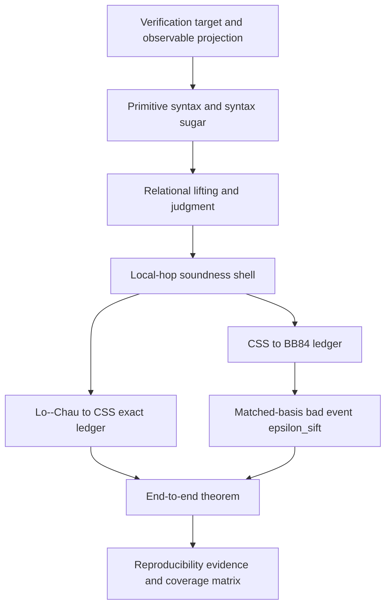

# Revision Report

## 1. Executive Summary

The revised paper now reads as a QKD reduction paper first and a verifier paper second. The main claim is narrowed to machine-checked game-hopping reductions for the Lo--Chau/CSS/BB84 lineage. The verification framework starts from observable projections and output-distance goals, then introduces the language, syntax sugar, address discipline, relational judgment, and rules needed to support the two hopping ledgers.

The central proof structure is now theorem-backed. The manuscript states a local-hop soundness shell, an exact Lo--Chau-to-CSS theorem, a lossy CSS-to-BB84 theorem, and an end-to-end composition theorem. The only displayed lossy edge is the matched-basis sifting bridge, whose loss is written consistently as `\varepsilon_{\mathrm{sift}}`; BB84 length slack is written as `s`, avoiding the previous collision between length and approximation notation.



## 2. Section-by-Section Issue List

| Location cue | Original issue | Revision |
|---|---|---|
| Former Section 2 opening | Began with language details before saying what is verified. | Section 2 now starts with verification target, observable projection, and security objective at `main.tex:110`. |
| Former syntax block | Primitive syntax and syntax sugar were mixed. | Primitive syntax is separated from derived syntax; appendix table records expansions at `main.tex:760`. |
| Former judgment definition | `[[P]]` was used too late or implicitly. | Denotational semantics is introduced before judgments at `main.tex:126`. |
| Quantum append/select discussion | Aliasing could be read as executable assignment. | Added explicit aliasing/no-copy remark at `main.tex:154`. |
| Former Section 3 | Figure text did not elevate hop bundles into theorem statements. | Added theorem shells at `main.tex:241`, `259`, `424`, and `657`. |
| Former case-study discussion | Exact and lossy hops were mostly visual. | Obligation tables now state exact/lossy status at `main.tex:279` and `446`. |
| Former evaluation summary | Mixed cryptographic parameters with verifier metrics. | Section 4 is now Evaluation and Reproducibility at `main.tex:677`. |
| Former related work | Claims, assumptions, limitations, and comparisons were blended. | Section 5 separates them at `main.tex:732`. |
| Former appendices | Long prose dumps were hard to scan. | Syntax and rule appendices are tables at `main.tex:760` and `793`. |
| Former bibliography | Duplicated entries and inconsistent recent quantum-verification references. | Bibliography is deduplicated and ordered by lineage from `main.tex:864`. |

## 3. Notation Inventory

The table lists manuscript-level symbols that a reader needs to track across the proof. Standard norms and Hilbert-space notation are omitted only when they are conventional.

| Symbol | Meaning | Sort | First use |
|---|---|---|---|
| `G`, `G_j` | Game/program checkpoint in a hopping ledger | protocol program | `main.tex:112` |
| `\mathsf{Pub}(G)` | Public authenticated transcript of game `G` | classical transcript | `main.tex:112` |
| `K_A`, `K_B` | Alice and Bob final key outputs | classical strings | `main.tex:112` |
| `\pi`, `\pi_{\mathrm{LC/CSS}}`, `\pi_{\mathrm{CSS/BB84}}` | Observable projection for a comparison | projection function | `main.tex:112`, `259`, `424` |
| `\mathsf{Out}_{\pi}(G)` | Compared output `(projected transcript, keys)` | random variable/distribution | `main.tex:112` |
| `\rho_{KEC}`, `\tau_K`, `E`, `C` | Composable secrecy state, ideal key, Eve, transcript | c-q state components | `main.tex:117` |
| `\epsilon_{\mathrm{sec}}` | External QKD secrecy bound | security parameter | `main.tex:119` |
| `\varepsilon`, `\varepsilon_j`, `\varepsilon_{\mathrm{sift}}` | Proof-hop approximation budgets | probability/error budget | `main.tex:122`, `241`, `424` |
| `s` | BB84 candidate slack length | integer parameter | `main.tex:122`, `570` |
| `S`, `P`, `P'` | Program statements | source programs | `main.tex:129`, `204` |
| `\llbracket P\rrbracket` | Denotational semantics of program `P` | CPTP/subdistribution semantics | `main.tex:126` |
| `x`, `p`, `\bar q` | Classical, probability, and quantum registers | addressed variables | `main.tex:139` |
| `\operatorname{addr}` | Fixed address map for indexed variables | address function | `main.tex:154` |
| `\mathbf{rand}`, `\mathbf{shuffle}` | Uniform bit-string and fixed-weight selector samplers | syntax sugar | `main.tex:172` |
| `\mathbf{select}`, `\mathbf{append}` | Selection and append macros | syntax sugar | `main.tex:175` |
| `L` | Public leakage transcript | classical log | `main.tex:180` |
| `\SepD` | Separable density operators | set of states | `main.tex:184` |
| `\Delta`, `\Delta'` | c-q input states for two programs | c-q states | `main.tex:190` |
| `A`, `\Phi`, `\Psi` | Projective relational assertions | projectors | `main.tex:193`, `200` |
| `\pi` (lifting witness) | Coupling witness for approximate lifting | c-q separable witness | `main.tex:194` |
| `\equiv_V` | Equality assertion on paired locations `V` | projector | `main.tex:204` |
| `\Delta_{\mathrm{TV}}` | Total variation distance | distance | `main.tex:214` |
| `\Phi_{\bar q}^{\mathcal B}` | Uniformity witness assertion in basis `\mathcal B` | projector | `main.tex:230` |
| `\mathcal I_i` | Named hop interface in a ledger | proof-edge label | `main.tex:286`, `454` |
| `c_a`, `c_b` | Alice/Bob check strings | classical strings | `main.tex:282` |
| `k`, `k'`, `x`, `x_1`, `x_2` | CSS/BB84 key-side and raw strings | classical strings | `main.tex:292`, `467` |
| `b`, `b_1`, `b_2` | Alice basis, retained basis, Bob basis | classical basis strings | `main.tex:311`, `436` |
| `f_{\mathbf c}`, `f_{x,b}` | CSS/Lo--Chau and BB84 selectors | classical selectors | `main.tex:312`, `454` |
| `\nu_k`, `x-\nu_k` | Reconciliation syndrome/mask component and public mask | classical strings | `main.tex:450` |
| `\mathsf{B}_0`, `\mathsf{B}_1` | Lo--Chau/CSS backbones around changed fragments | program contexts | `main.tex:299` |
| `\mathsf{QEC}_A`, `\mathsf{QEC}_B` | Alice/Bob QEC subprograms | protocol macros | `main.tex:300` |
| `\mathsf{Encode}_{x,z}`, `\mathsf{Decode}` | CSS encoding/decoding macros | protocol macros | `main.tex:300` |
| `\mathsf{Ch}_{f_{\mathbf c}}`, `\mathsf{Ch}^{\mathrm{BB84}}` | Adversarial channel interfaces | unitary channel macros | `main.tex:299`, `436` |
| `\mathsf{Recv}_{2n}`, `\mathsf{Sift}^{2n}_{b,b_2}` | Received-set and matched-basis selection macros | syntax sugar | `main.tex:440` |
| `\mathsf{Part}^{Q}`, `\mathsf{Part}^{C}` | Quantum and classical partition macros | syntax sugar | `main.tex:456` |
| `X` | Number of matched bases in the bad-event analysis | binomial random variable | `main.tex:679` |

## 4. Detailed Edit Table

| Area | Old draft behavior | Revised behavior |
|---|---|---|
| Novelty claim | Broadly implied first machine-checked QKD security case study. | Narrows claim to explicit machine-checked game-hopping reductions for QKD. |
| Approximation notation | Used `\delta` both as proof loss and length slack. | Uses `\varepsilon` for proof loss and `s` for length slack. |
| Theorem structure | Hopping relations were stated mostly in prose. | Adds local-hop, two ledger, and end-to-end theorem shells. |
| Output-distance bridge | Missing explicit lemma from judgments to output distance. | Adds Lemma `From relational lifting to output distance`. |
| Figure integration | Figures were central visually but not theorem-indexed. | Captions and text connect figures to theorem and obligation tables. |
| Reproducibility | Evaluation summary was a compact paragraph. | Adds replay evidence table, coverage matrix, and bad-event calculation. |
| Appendices | Long rule/syntax prose dumps. | Converts syntax and rule status into tables. |
| References | Duplicated quantum and classical verification entries. | Deduplicates and adds recent comparators: CoqQ 2023, approximate relational reasoning 2024, complete qRHL 2025. |


## 5. Rewritten Text Coverage

The affected manuscript text is in `main.tex:110-1183`. The title, abstract, and introduction end before `main.tex:110` and were left in place. The rewritten body includes the following sections:

| Revised section | Location | Main content |
|---|---:|---|
| Verification Target, Language, and Logic | `main.tex:110` | Observable projection, primitive syntax, syntax sugar, aliasing remark, lifting, judgment, output-distance lemma. |
| QKD Reduction Ledgers | `main.tex:254` | Theorem-backed Lo--Chau/CSS and CSS/BB84 ledgers with obligation tables and revised figure captions. |
| Evaluation and Reproducibility | `main.tex:677` | Bad-event analysis, replay evidence, recommended sweeps, coverage matrix. |
| Claims, Assumptions, Limitations, and Related Work | `main.tex:732` | Clear separation of what is verified, assumed, limited, and compared. |
| Conclusion | `main.tex:753` | Compact restatement of exact and lossy composition result. |
| Appendices | `main.tex:760` | Syntax table, rule-status table, simulation pseudocode, unit-test list, out-of-scope warnings. |

## 6. Inserted Definitions, Remarks, Lemmas, and Theorems

The revision adds one explicit aliasing/no-copy remark, one output-distance lemma, a local-hop soundness theorem shell, two ledger theorems, and one end-to-end theorem. Each theorem names its observable and distance notion. Proof sketches are intentionally compact: the paper is not claiming new QKD coding theory, but a checked reduction ledger.

| Item | Location | Role |
|---|---:|---|
| Aliasing and quantum renaming remark | `main.tex:154` | Clarifies renaming vs executable assignment for quantum variables. |
| Output-distance lemma | `main.tex:208` | Bridges approximate judgments to total-variation bounds. |
| Local-hop soundness shell | `main.tex:241` | States per-hop judgment shape and exact/lossy classification. |
| Lo--Chau to CSS ledger theorem | `main.tex:259` | Exact distribution equality for `\mathsf{Out}_{\mathrm{LC/CSS}}`. |
| CSS to BB84 ledger theorem | `main.tex:424` | Total-variation bound by `\varepsilon_{\mathrm{sift}}`. |
| End-to-end QKD reduction theorem | `main.tex:657` | Composes both ledgers into one output-distance statement. |

## 7. Figure Revision Plan and Captions

The figures remain U-shaped hopping ledgers. The revised captions make their proof role explicit. Figure 1 is an exact Lo--Chau-to-CSS ledger whose edges are discharged by Theorem 2 and Table 1. Figure 2 is a CSS-to-BB84 ledger whose only lossy edge is matched-basis sifting. A future visual pass could remove the remaining figure-level font substitution warning by redrawing the TikZ coordinates without `\resizebox`, but the current PDF compiles and no formula overflow remains.

| Figure/table | Revised caption role |
|---|---|
| Figure 1 | States that colors align corresponding fragments and all displayed edges are exact. |
| Figure 2 | States that `\mathcal I_5` is the only lossy hop and contributes `\varepsilon_{\mathrm{sift}}`. |
| Table 1 | Lists Lo--Chau/CSS obligations, status, and loss. |
| Table 2 | Lists CSS/BB84 obligations, status, and loss. |
| Table 3 | Separates reported replay evidence from recommended sweeps. |
| Table 4 | States fully mechanized vs script-guided coverage. |

## 8. Reproducibility Subsection

The reproducibility section now says what must be archived for replay: protocol model, normalized AST, hop ledger, side-condition report, proof-node trace, and `\varepsilon` budget file. It also separates artifact metrics from cryptographic parameters and labels parameter sweeps as recommended when not already reported. The large reported bad-event value is framed as a demonstration/debug instance rather than a security recommendation.

| Artifact component | Coverage |
|---|---|
| Parser/address checks | Fully mechanized |
| Syntax-sugar expansion | Fully mechanized for listed macros |
| Structural rules | Mechanized |
| Uniformity bridge | Script-guided lemma with mechanized applications |
| Lo--Chau/CSS ledger | Mixed: automated structural hops and guided interface lemmas |
| CSS/BB84 ledger | Mixed: automated syntax/address hops and guided channel/UTB lemmas |
| Matched-basis analysis | Exact formula in text; empirical harness recommended |

## 9. Simulation Pseudocode and Unit Tests

```python
def estimate_sift_loss(n, slack, trials, rng):
    N = 4*n + slack
    bad = 0
    for _ in range(trials):
        alice_basis = rng.bits(N)
        bob_basis = rng.bits(N)
        matched = 0
        for i in range(N):
            if alice_basis[i] == bob_basis[i]:
                matched += 1
        if matched < 2*n:
            bad += 1
    return bad / trials

def exact_sift_loss(n, slack):
    N = 4*n + slack
    total = sum(comb(N, j) for j in range(2*n))
    return total / (2**N)
```

Recommended artifact unit tests:

```text
test_check_offset_ca_to_qbar_2n_plus_i
test_key_offset_k_to_qbar_3n_plus_i
test_selected_unitary_rejects_duplicate_addresses
test_quantum_append_is_alias_not_copy
test_publish_log_preserved_by_exact_hops
test_exact_hops_emit_zero_epsilon
test_sift_loss_exact_matches_monte_carlo_with_tolerance
test_bad_event_bridge_adds_only_epsilon_sift
test_key_bit_as_measure_rewrite_is_blocked
test_css_channel_renaming_preserves_eve_interface_order
```

## 10. Reference-Fix Table

| Old entry/key | Issue | Corrected handling |
|---|---|---|
| `barthe2009formal` and `barthe2009prhl` | Duplicate POPL 2009 CertiCrypt entry under two keys. | Kept one CertiCrypt/POPL 2009 entry with DOI `10.1145/1480881.1480894`. |
| `barthe2011computer` and `barthe2009certicrypt` | EasyCrypt/CertiCrypt lineage was mixed by key naming. | Kept EasyCrypt CRYPTO 2011 as `barthe2011computer`, DOI `10.1007/978-3-642-22792-9_5`. |
| `barthe2012probabilistic` | Correct pRHL reference needed priority placement. | Kept MPC 2012 pRHL, DOI `10.1007/978-3-642-31113-0_1`. |
| `barthe2019relationalq` and `barthe2020relational` | Duplicate relational quantum programs entry. | Kept PACMPL POPL 2020, DOI `10.1145/3371089`. |
| Missing CoqQ | Recent proof-assistant comparator absent. | Added CoqQ POPL 2023, DOI `10.1145/3571222`. |
| Missing approximate relational reasoning 2024 | Recent approximate quantum relational comparator absent. | Added CAV 2024, DOI `10.1007/978-3-031-65633-0_22`. |
| `barthe2025complete` | Needed DOI and current LICS details. | Set LICS 2025 pages 884--925, DOI `10.1109/LICS65433.2025.00072`. |
| `renner2005information` and `renner2005infotheoretic` | Duplicate Renner/Gisin/Kraus PRA entry. | Kept one `renner2005information` entry. |
| `lucamarini2018overcoming` and `lucamarini2018tf` | Duplicate Nature TF-QKD entry. | Kept one `lucamarini2018overcoming` entry. |
| `liu2023twinfield` and `wang2024tf1002` | Duplicate Liu et al. 1000 km TF-QKD entry. | Kept one `liu2023twinfield` entry. |
| `portmann2014cryptographic` | Key name suggested 2014 while entry is RMP 2022. | Kept key for compatibility but corrected citation text to RMP 2022. |
| `cao2026cow` | Needed current-year verification. | Kept Science Advances 2026 entry, DOI `10.1126/sciadv.aec2776`. |

## 11. Reviewer-Risk Checklist

The main remaining risk is that several high-level CSS/QEC and channel-interface lemmas are still script-guided. The paper now says this directly, but reviewers may ask for more proof-script detail or a public artifact hash.

The second risk is that the figure TikZ pictures still use `\resizebox`, which causes a font-size substitution warning even though the PDF builds and no formulas overflow. A camera-ready pass should redraw them at native scale.

The third risk is scope: the proof does not verify physical devices, finite-key parameter optimization, detector models, source flaws, or reconciliation implementation leakage. Section 5 now states these as assumptions and limitations, but reviewers from applied QKD may still ask for a tighter boundary between symbolic reductions and deployed systems.

The fourth risk is the introduction. It remains untouched as requested, so it still uses `\delta` terminology and a broad novelty sentence. The technical body narrows the claim and moves to `\varepsilon`; Appendix C flags this out-of-scope inconsistency.
